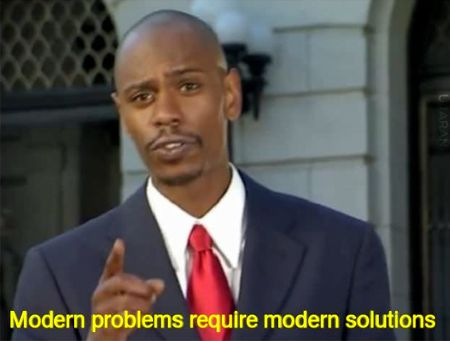
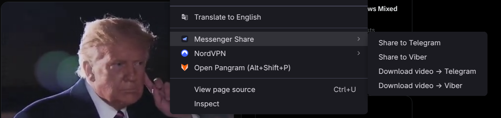

# omarchy-messenger-share



Right-click share links, images, selected text, and videos from Brave straight
to **Telegram** and **Viber** on [Omarchy](https://omarchy.org). Replaces the
download → open folder → find window → drag-drop routine with one menu click.

## Menu items



| Right-click on | Menu item | What happens |
|---|---|---|
| Anything | **Share to Telegram / Viber** | Link/text lands on your clipboard, app is focused — Ctrl+V in a chat |
| An image | **Share to Telegram / Viber** | Image is fetched with your login cookies, then: Telegram opens its "Forward to…" chat picker; Viber gets it on your clipboard — Ctrl+V |
| A video or its page | **Download video → Telegram / Viber** | yt-dlp grabs the video (mp4, ≤720p) to `~/Downloads` with live progress in the Omarchy OSD, then hands it off |

Telegram takes files through its native chat picker — pick the friend, done.
Viber has no command line and its input **only** accepts pasted images, so
non-image files (videos mostly) get a Files window opened next to Viber with
the file pre-selected — drag it into the chat. I don't make the rules.

## Requirements

Omarchy (uses `omarchy-launch-or-focus`, `omarchy-notification-send`,
`omarchy-osd`, `omarchy-clipboard-paste-file`), Brave, `telegram-desktop`,
`viber`, `yt-dlp`, `wl-clipboard`, `jq`, `openssl`.

## Install

```bash
git clone https://github.com/CostaFot/omarchy-messenger-share.git
cd omarchy-messenger-share
./install.sh
```

Then:

1. Open `brave://extensions`, enable **Developer mode**
2. **Load unpacked** → select the `extension/` folder
3. Check the extension ID matches the one `install.sh` printed
4. Restart Brave once (native-host manifests are read at startup)

`install.sh` generates a local `key.pem` (gitignored) that pins the extension
ID, and writes one file outside the repo:
`~/.config/BraveSoftware/Brave-Browser/NativeMessagingHosts/com.costa.messenger_share.json`.
No sudo, nothing system-wide.

## Uninstall

```bash
./install.sh --uninstall
```

Then remove the extension in `brave://extensions` and delete this folder.

## Notes

- Video downloads work anywhere yt-dlp does. Tested daily: YouTube, X/Twitter,
  Instagram, TikTok.
- On X/Twitter, right-click a video or anywhere on its tweet — the extension
  figures out which tweet you clicked, even from the timeline. X's own video
  menu is suppressed so the browser menu can show.
- Instagram works from the home feed, the reels viewer, and open posts.
  Stories are login-gated and not supported.
- TikTok works from the For You feed, the explore and profile grids, and open
  videos. TikTok's own right-click menu (Speed / Quality / Download…) is
  suppressed the same way. Photo carousels aren't videos — share those as
  images.
- On YouTube, the first right-click on the player shows YouTube's own menu;
  right-click a second time for the browser menu.
- Videos are capped at 720p because Viber passes files through nearly
  unchanged — every extra pixel is bytes your friends download — and the apps'
  own compression tops out around 720p anyway. Override with
  `MESSENGER_SHARE_MAX_HEIGHT`.
- Downloaded media stays in `~/Downloads`. Override with `MESSENGER_SHARE_DIR`,
  set in the environment Brave inherits (e.g. via uwsm env).
- Downloads run as a transient systemd user unit — closing Brave mid-download
  doesn't kill them.
- Images with `blob:` URLs can't be fetched and show a "Share failed"
  notification (rare).
