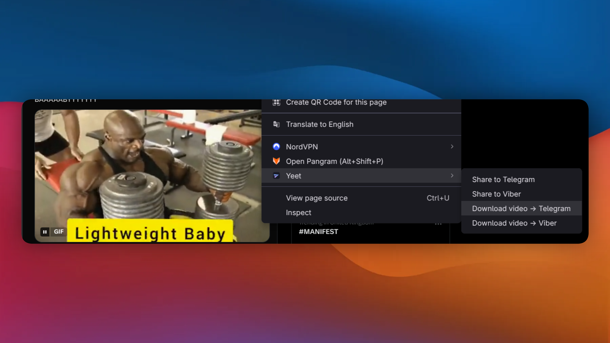
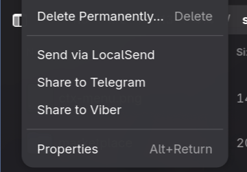

# Yeet


Share to **Telegram** and **Viber** on [Omarchy](https://omarchy.org).

A bar widget for clipboard, files, and video links, plus right-click share in
Brave/Chromium and Files. 

Replaces the download → open folder → find
window → drag-drop dance.


```bash
omarchy plugin add https://github.com/CostaFot/omarchy-yeet --enable
```

## Widget




That puts an icon in the bar. 

Click it (or `omarchy-shell
costafot.yeet toggle` from a keybinding) and pick a row:

| Row | What happens |
|---|---|
| **Clipboard** | Text/link: the app is focused, paste in a chat. An image (screenshots): saved and sent like any image share |
| **File…** | Pick a file, it's handed to the app |
| **Video from copied link** | yt-dlp grabs the video from the URL you copied, live progress in the OSD, then hands it off |


A **Set up browser
sharing…** row appears until the browser half below is set up.

Telegram takes files through its native chat picker — pick the friend, done.

Viber has no command line and its input **only** accepts pasted images, so
non-image files (videos mostly) get a Files window opened next to Viber with
the file pre-selected — drag it into the chat. I don't make the rules.

## From the browser


The extension overrides the right click menu where needed to bring the default menu options. 


| Right-click on | Menu item | What happens |
|---|---|---|
| Anything | **Share to Telegram / Viber** | Link/text lands on your clipboard, app is focused — Ctrl+V in a chat |
| An image | **Share to Telegram / Viber** | Image is fetched with your login cookies, then: Telegram opens its "Forward to…" chat picker; Viber gets it on your clipboard — Ctrl+V |
| A video or its page | **Download video → Telegram / Viber** | Same yt-dlp flow as the bar widget |

## From Files (Nautilus)



The same two items on a right-clicked file in Files (needs
`nautilus-python`; `install.sh` sets it up). Same rules as above: Telegram
opens its chat picker, Viber takes images via clipboard and everything else
via drag. One file at a time.

## Via terminal (or your agent)

Every row is also a command — and `send` takes the payload inline, so
keybindings, scripts, and AI agents can share without touching the panel:

```bash
omarchy-shell costafot.yeet share telegram clipboard    # same as the rows
omarchy-shell costafot.yeet send telegram text "meeting moved to 3pm"
omarchy-shell costafot.yeet send telegram file ~/Downloads/report.pdf
omarchy-shell costafot.yeet send viber video https://x.com/i/status/123456
```


## Requirements

- Omarchy (uses `omarchy-launch-or-focus`, `omarchy-notification-send`,
`omarchy-osd`, `omarchy-clipboard-paste-file`, `omarchy-file-select`)

- `telegram-desktop` and/or `viber`

- `yt-dlp`, `wl-clipboard`, `jq`. 


Optional:
Brave or Chromium for the right-click share, `nautilus-python` for the Files
right-click.

## Install

The plugin route above is the whole install for the bar widget — the share
backend is bundled for convenience.

The browser + Files half needs one more step, from the panel's **Set up
browser sharing…** row or by hand:

```bash
~/.config/omarchy/plugins/costafot.yeet/install.sh
```

Then restart the browser.

`install.sh` finds your browsers (Brave, Chromium — every one you have) and
writes three things, all user-level, nothing system-wide:

- the native-host manifest in each browser's `NativeMessagingHosts/` dir
- a `--load-extension` entry in each browser's flags file
  (`brave-flags.conf` / `chromium-flags.conf`) — the same mechanism Omarchy
  uses for its own bundled extensions
- a symlink in `~/.local/share/nautilus-python/extensions/` for the Files
  menu (`nautilus -q` to reload)

Don't like the plugin system? `git clone` + `./install.sh` works
the same, minus the bar widget.

Please read the source code. 

## Uninstall

```bash
~/.config/omarchy/plugins/costafot.yeet/install.sh --uninstall
omarchy plugin remove costafot.yeet
```

Then restart the browser — the extension unloads with the flag.

## Random shenanigans

- Video downloads work anywhere yt-dlp does.
- On X/Twitter, right-click a video or anywhere on its tweet — the extension
  figures out which tweet you clicked, or I hope so anyway.
- Instagram: home feed, reels viewer, open posts. Stories are login-gated and
  not supported.
- TikTok: For You feed, explore and profile grids, open videos. Photo
  carousels aren't videos — share those as images.
- X and TikTok replace the browser's right-click menu on videos with their
  own; the extension suppresses that so sharing works. On YouTube, right-click
  the player twice — the first click gets YouTube's own menu.
- Videos are capped at 720p because Viber passes files through nearly
  unchanged and my friend already put up with me enough. Feel free to override it in the config file.
- Downloads land in `~/Downloads` and run as a transient systemd user unit,
  so closing the browser mid-download doesn't kill them. Folder and cap are
  overridable in `~/.config/omarchy-yeet/config` (plain shell, takes effect
  on the next share):

  ```sh
  YEET_DIR="$HOME/Videos/shares"
  YEET_MAX_HEIGHT=1080
  ```
- Images with `blob:` URLs can't be fetched and show a "Share failed"
  notification (rare).
- No Chrome, sorry: Google removed `--load-extension` from branded Chrome
  in 2025, so there's no way to auto-install the extension there.
- Heads up for the security-minded: the browser extension talks to a
  native-messaging host — a bash script on your machine that your browser is
  allowed to start. That's the entire mechanism, it's ~200 lines, and it's in
  [`host/yeet-host`](host/yeet-host). Read the source code - I am not after your credit card.
